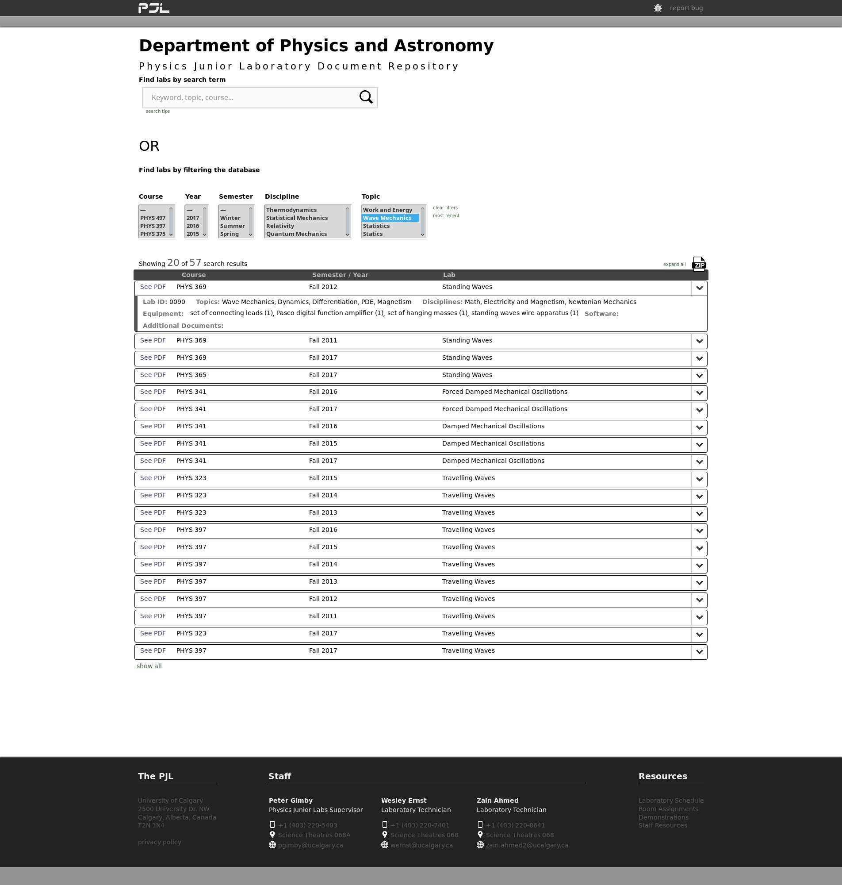
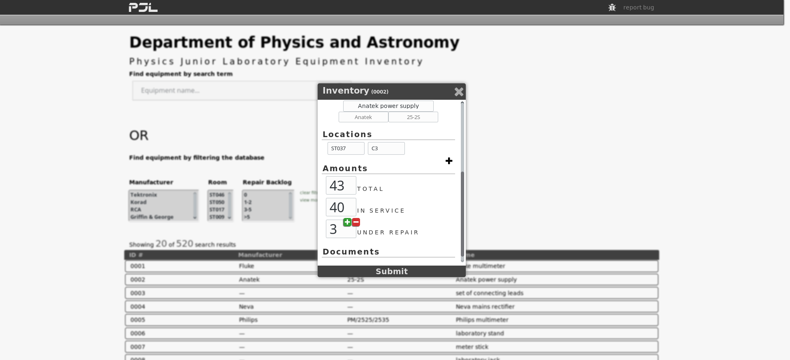

# pjl-web
### Document dump for the PJL at UofC


## **To Do List**

XML validation (done)  
PHP to handle database edit POSTS (done)  
Refine site-wide/page-specific scripts and stylesheets and implement page-specific JS namespaces (done)  
Dashboard to edit XMLs (removed from project - functionality incorporated into inventory page)  
Populate equipment tags in lab XML (done)  
Populate topics / disciplines / ID#s (done)  
Add legacy labs (done)  
Support docs  
External references (done)  
Companion guides  
325 final project ideas  


## **Pages to add**

Landing page (completed)  
Repository (completed)  
Equipment page template with URL string queries (completed)  
Database editing dashboard(s) (removed from project)  
Staff profiles (removed from project)  
Room scheduling interactive map (removed from project)  
Demos repository (removed from project)  
403, 404, 500, 503 HTTP error pages  


# Lab Meta Data


## **Disciplines**  
###### Labs are identified with disciplines when the discipline constitutes a significant focus of the lab (This is a master list. Disciplines added to this list will be read by pjlDB.py to validate the XML)

<!---start disciplines-->
Newtonian Mechanics  
Electricity and Magnetism  
Optics  
Thermodynamics  
Fluid Mechanics  
Statistical Mechanics  
Quantum Mechanics  
Relativity  
Particle Physics  
Nuclear Physics  
Math  
Laboratory Skills  
Computer Skills  
<!---end disciplines-->


## **Topics**  
###### Labs are identified with topics when the topic constitutes a significant focus of the lab or if the topic is an explicitly necessary pre-requisite (This is a master list. Topics added to this list will be read by pjlDB.py to validate the XML)

<!---start topics-->
Electrostatics  
Circuits  
PDE  
ODE  
Statistics  
Linear Algebra  
Integration  
Differentiation  
Rotational Motion  
Statics  
Kinematics  
Collisions  
Dynamics  
Measurements  
Work and Energy  
Friction and Drag  
Momentum  
Conservation Laws  
Magnetism  
Interference  
Polarization  
Newton’s Laws  
Wave Mechanics  
Refraction  
Hydrostatics  
Gas Laws  
Programming  
<!---end topics-->


# Database Templates

## **Lab XML Template**


```
<Labs>
    <Lab labId="0001">
        <Name />
        <Disciplines>
            <Discipline />
            ...
        </Disciplines>
        <Topics>
            <Topic />
            ...
        </Topics>
        <Versions>
            <Version>
                <Path />
                <Semester />
                <Year />
                <Course />
                <Directory />
            </Version>
            ...
        </Versions>
        <Equipment>
            <Item id="0001">
                <Name />
                <Amount />
            </Item>
            ...
        <Equipment />
        <Type />
        <SupportDocs>
            <Doc>
                <Name />
                <Path />
            </Doc>
            ...
        </SupportDocs>
        <Software>
            <Name />
            ...
        </Software>
    </Lab>
    ...
</Labs>

```


## **Equipment XML Template**

```
<Equipment>
    <Item id="0001">
        <InventoryName />
        <Identification>
            <Manufacturer />
            <Model />
        </Identification>
        <Kit isKit="false"/>
        <Locations>
            <Location>
                <Room />
                <Storage />
            </Location>
            ...
        </Locations>
        <Quantity>
            <Total />
            <InService />
            <UnderRepair />
        </Quantity>
        <Documents>
            <Document>
                <Name />
                <Location />
            </Document>
            ...
        </Documents>
    </Item>
    ...
</Equipment>
```


# PJL Website Use Cases
#### An instructor will be teaching PHYS 325 for the first time in several years. They want to see the lab experiments that have been run in the intervening time period.


#### An instructor would like to modify last semester's lab experiment document to correct errata found by TAs.


#### A PJL lab tech just pulled a force plate out of service and wants to update the equipment inventory to reflect this change.


#### A PJL lab tech has just finished repairing a broken force plate and wants to update the equipment inventory to reflect this change.


#### An instructor wants to add a lab involving Statistical mechanics and wants to know if the PJL has any labs covering that topic.


#### An instructor thinks there may be an error in a companion guide and wants to investigate the original data.


#### A PJL tech is doing repairs and wants to prioritize their efforts by focusing on the equipment with the most items down for repair. They want to see any equipment with a repair backlog greater than 5.


#### The repair backlog of Cenco power supplies is quite high. Concerned that there may not be enough power supplies to service upcoming labs, a PJL lab tech wants to know which labs the Cenco power supplies are used in.


#  pjlDB.py Documentation


## Example Code

### Importing the Module and Creating a Database Object

```
from pjlDB import *

#lab database
db = LabDB("path/to/labDB.xml")

#equipment database
db = EquipDB("path/to/equipmentDB.xml")
```

### Modifying a Lab in the Database

```
#get the lab you want by name
lab = db.getLab(name="Faraday's Law")

#or by id number
lab = db.getLab(idnum="0037")

#change any of its properties
lab.topics = ["PDE", "Polarization"]
lab.addVersion({"path": "/data/repository/path/to/version.pdf, 
                "semester": "Winter", 
                "year": "2018", 
                "course": "PHYS 369", 
                "directory": "/data/repository/path/to/directory"})
lab.addEquipment({"id": "0001", 
                  "name": Fluke multimeter", 
                  "amount": "2", 
                  "alt-id": "0005", 
                  "alt-name": "Philips multimeter"})
lab.addSupportDoc({"name": "user manual", 
                   "path": "/path/to/support/doc.pdf"})

#add back to the db to replace the previous version
db.addLab(lab)
db.save("../../dev/updated_lab_database.xml", ignore_validation=False)
```


### Adding a New Lab to the Database

```
#Import an XML and make a database object
db = LabDB("../labDB.xml")

#make a new lab object with the next available lab ID
newlab = db.newLab(db.new_id)

#Add the simple stuff; name and type
newlab.name = "Fraunhofer Diffraction"
newlab.lab_type = "Lab"

#Add disciplines and topics
newlab.disciplines = ["Optics", "Math", "Laboratory Skills"]
newlab.topics = ["ODE", "PDE", "Polarization"]

#Add versions
versions = [{"path": "/data/repository/path/to/pdf",
             "semester": "Fall",
             "year": "2013",
             "course": "PHYS 375"},
            {"path": "/data/repository/path/to/pdf",
             "semester": "Summer",
             "year": "2016",
             "course": "PHYS 369"},
            {"path": "/data/repository/path/to/pdf",
             "semester": "Winter",
             "year": "2015",
             "course": "PHYS 375"}]
newlab.versions = versions

#Add equipment
equipment = [{"id": "0035", "name": "Fluke multimeter", "amount": "2", "alt-name": "Philips multimeter", "alt-id": "0005"},
             {"id": "0003", "name": "Anatek power supply", "amount": "1", "alt-name": "", "alt-id": ""},
             {"id": "0143", "name": "small optical bench mount", "amount": "12", "alt-name": "", "alt-id": ""},
             {"id": "0205", "name": "1 m optical bench", "amount": "1", "alt-name": "", "alt-id": ""}]
newlab.equipment = equipment

#Add support documents and software
supportdocs = [{"name": "Hugo's notes", "path": "/data/repository/path/to/file"},
               {"name": "TEX document", "path": "/data/repository/path/to/file"}]
newlab.support_docs = supportdocs
software = ["1D motion.cmbl", "Vernier Logger Pro", "VPython"]
newlab.software = software

#Add this new lab to the database and save the changes
db.addLab(newlab)
db.save("../../dev/updated_lab_database.xml", ignore_validation=False, error_log=True)
```


### Adding New Equipment to the Equipment Database

```
db = EquipDB("path/to/equipmentDB.xml")

newitem = db.newItem(db.new_id)

#add equipment info
#you may also simply add the item with only an ID and modify its information via
#the website equipment edit page

newitem.name = "Canon digital camera"
newitem.manufacturer = "Canon"
newitem.model = "ABC-123"
newitem.is_kit = False
newitem.locations = [{"room": "ST039", "storage": "Other"}]
newitem.quantity = {"total": "12", "service": "12","repair": "0"}
newitem.documents = [{"name": "warrantee", "location": "/path/to/document.pdf"}]

db.addItem(newitem)
db.save("path/to/updated/equipmentDB.xml", ignore_validation=False, error_log=False)

```


## Use Cases
#### A PJL lab tech wants to add the previous semester's lab versions to existing labs in the database.

```
from pjlDB import *

new_versions = [[0001, '/data/repository/path/to/PDF.pdf', 'Fall', 2017, 'PHYS 397'],
                [0032, '/data/repository/path/to/PDF.pdf', 'Fall', 2017, 'PHYS 375'],
                [0101, '/data/repository/path/to/PDF.pdf', 'Fall', 2017, 'PHYS 211']]


db = LabDB("path/to/labDB.xml")

for version in new_versions:

    lab = db.getLab(idnum=version[0])

    new_version = {"path": version[1],
                   "semester": version[2],
                   "year": version[3],
                   "course": version[4],
                   "directory": "/" + "/".join(version[1].split("/")[:-1])}
    
    lab.addVersion(new_version)

    db.addLab(lab)

db.save("/dev/updatedlabDB.xml", ignore_validation=False, error_log=True)
```

#### The PJL has received a new multimeter that will replace the Philips multimeter in all lab setups. A lab tech wants to replace instances of the Philips multimeter with the new multimeter but keep the Philips as an alternate.

```
#import packages
from pjlDB import *


eqdb = EquipDB("../equipmentDB.xml")


#create the new item and fill in its properties
new_item = eqdb.newItem(eqdb.new_id)

#any or all of these properties may be unassigned
#a valid equipment item only needs an ID number
new_item.name = "Pasco multimeter"
new_item.manufacturer = "Pasco"
new_item.model = "A1"
new_item.is_kit = False
new_item.locations = [{"room": "ST038", "storage": "C4"}]
new_item.quantity = {"total": "24", "service": "24", "repair": "0"}
new_item.documents = [{"name": "user manual", "location": "/data/equipment/0601/manual.pdf"}]

#add new item to the inventory and save
eqdb.addItem(new_item)
eqdb.save("updatedequipmentDB.xml")


#now that we've created a new equipment item we need to find all labs
#that contain the item it will replace

#we're replacing the Philips multimeter, id=0005
replaced = "0005"

#we're replacing it with the newly created item
replaced_with = new_item

#open up the lab database
labdb = LabDB("../labDB.xml")

#push_to_alternate will make the old item an alternate piece of equipment for the lab
labdb.replaceEquipment(replaced, replaced_with, push_to_alternate=True)

labdb.save("updatedlabDB.xml")
```

#### An instructor has designed and written a new lab experiment. A PJL lab tech wants to add this new lab to the database.

```
#import packages
from pjlDB
```


#### The PJL just received 2 new oscilloscopes for use in the shop. A lab tech wants to add this new item to the inventory.

```

```


## Convenience Functions

##### pjlDB.isValidID(idnum)
> Checks if idnum is a valid ID number. Returns True if valid, False if not.


##### pjlDB.getTopics()
> Returns a list of valid topics taken from the pjl-web README.


##### pjlDB.getDisciplines()
> Returns a list of valid disciplines taken from the pjl-web README.


##### pjlDB.crossValidateEquipment()
> This function returns nothing. It checks if every equipment item listed in the lab database has an entry in the equipment database. If an item is found listed in the equipment list for a lab and it isn't listed in the equipment database an error log will be printed in the console.


## pjlDB.LabDB


### Properties
> Properties can be assigned to directly but beware that you will overwrite what was there before.

##### LabDB.tree
> An `xml.etree.ElementTree.ElementTree` object for the database being held.


##### LabDB.root
> An `xml.etree.ElementTree.Element` object that is the root element of LabDB.tree.


##### LabDB.labs
> a list of `_LabItem` objects. All the properties and methods of this class are described below.


##### LabDB.new_id
> This will always return the next available unused lab ID in the appropriate string form.


##### LabDB.length
> This will always return the current number of labs in the held database.


### Methods

##### LabDB.log_file_object()
> Returns an open error log file object that can be written into.

```
with LabDB.log_file_object() as f:
    f.write("my custom error message")
```


##### LabDB.newLab(idnum)
> Returns an empty `_LabItem` object with lab ID set to `idnum`. Throws an exception if `idnum` is not a valid form or if `idnum` already exists in the database.


##### LabDB.getLab(idnum=None, name=None)
> Returns a `_LabItem` object belonging to either `idnum` or `name`. Either lab ID or lab name may be used to access one of the labs in the database. Throws an exception if a matching lab cannot be found or if invalid arguments are passed.


##### LabDB.addLab(labitem)
> Adds a `_LabItem` object to the held database. If an identical lab already exists, it is replaced. If it does not already exist, a new lab entry is appended to the held database.


##### LabDB.deleteLab(idnum=None, name=None)
> Deletes a `_LabItem` object belonging to either `idnum` or `name`. Either lab ID or lab name may be used to access one of the labs in the database. Throws an exception if a matching lab cannot be found or if invalid arguments are passed.


##### LabDB.save(filename, ignore_validation=False, error_log=False)
> Saves the database as an XML file with UTF-8 encoding. If `ignore_validation` is True, `LabDB` will attempt to write the XML without any validation of its contents. If False, a full validation will be performed before writing. If `error_log` is True, an error report will be saved to the working directory. If False, the error log will be printed to the console.


##### LabDB.validateFull(error_log=False)
> Performs a full validation of the database being held. If `error_log` is True, the error log is written to a file in the working directory. If False, the error log is printed to the console.

```
db = LabDB("../labDB.xml")
db.validateFull(error_log=True)
```


##### LabDB.replaceEquipment(replaced, replace_with, push_to_alternate=False)
> Replace all instances of equipment item (`id=replaced`) with a new piece of equipment (a valid `_EquipmentItem` object). Optionally, the replaced item may become an alternate piece of equipment by setting `push_to_alternate=False`. If `push_to_alternate=True`, the equipment will simply be replaced in all lab equipment lists.

```
eqdb = EquipDB("equipmentDB.xml")
labdb = LabDB("labDB.xml")

replaced = "0005"
replace_with = eqdb.getItem(idnum="0001")

labdb.replaceEquipment(replaced, replaced_with, push_to_alternate=True)
labdb.save("updatedlabDB.xml")
```


##### LabDB.noDuplicateIDs(log_file=None)
> Checks if the database contains any duplicate lab IDs. Returns True if no duplicates found, False if duplicates found. if `log_file` is `None` then error log is printed to the console. If a file object is passed as an argument then the error log is written to that file.

```
db = LabDB("../labDB.xml")

with db.log_file_object() as f:
    db.noDuplicateIDs(log_file=f)
```


##### LabDB.hasUniqueEquipIDs(log_file=None)
> Checks if the database contains any non-unique equipment IDs. Returns True if none found, False if found. if `log` is None then error log is printed to the console. If a file object is passed as an argument then the error log is written to that file.

```
db = LabDB("../labDB.xml")

with db.log_file_object() as f:
    db.hasUniqueEquipIDs(log_file=f)
```


##### LabDB.hasValidPathRoots(log_file=None)
> Checks if the database contains any improper directory roots. Returns True if no improper paths found, False if found. if `log` is None then error log is printed to the console. If a file object is passed as an argument then the error log is written to that file.

```
db = LabDB("../labDB.xml")

with db.log_file_object() as f:
    db.hasValidPathRoots(log_file=f)
```


##### LabDB.hasValidTopics(log_file=None)
> Checks for invalid topics. Returns True if no invalid topics found, False if any found. if `log` is None then error log is printed to the console. If a file object is passed as an argument then the error log is written to that file.

```
db = LabDB("../labDB.xml")

with db.log_file_object() as f:
    db.hasValidTopics(log_file=f)
```


##### LabDB.hasValidDisciplines(log_file=None)
> Checks for invalid disciplines. Returns True if no invalid disciplines found, False if any found. if `log` is None then error log is printed to the console. If a file object is passed as an argument then the error log is written to that file.

```
db = LabDB("../labDB.xml")

with db.log_file_object() as f:
    db.hasValidDisciplines(log_file=f)
```


##### LabDB.hasValidTypes(log_file=None)
> Checks for invalid lab types. Returns True if no invalid types found, False if any found. if `log` is None then error log is printed to the console. If a file object is passed as an argument then the error log is written to that file.

```
db = LabDB("../labDB.xml")

with db.log_file_object() as f:
    db.hasValidTypes(log_file=f)
```


##### LabDB._isItAKit(idnum)
> Checks if an equipment item, specified by its 4 digit ID number, `idnum`, is a kit. Kits have the unique ability to have multiple names in the lab database as different parts of a kit may be used in the set up for a lab. Regardless of the name used, there will be one ID number shared by all which will correspond to one entry in the equipment database.


## pjlDB._LabItem(lab=None, idnum=None)
> Used by `LabDB` objects to store lab items. Type checking and validation of its properties is performed by the `LabDB` object **not** the `_LabItem` object. Optional arguments are an `xml.etree.ElementTree.Element` object representing a lab entry or a lab ID number (see properties for idnum format).


### Properties
> Properties can be assigned to directly but beware that you will overwrite what was there before.

##### _LabItem.id_num
> An integer between 0001 and 9999 inclusive. These are ID numbers and are unique to each lab.


##### _LabItem.name
> A string representing the name of a lab.


##### _LabItem.disciplines
> A list of strings representing valid disciplines associated with a lab. Valid disciplines are those listed in the pjl-web README.


##### _LabItem.topics
> A list of strings representing valid topics associated with a lab. Valid topics are those listed in the pjl-web README.


##### _LabItem.versions
> A list of dictionaries representing individual versions. Each dictionary has 4 keys: "path", "semester", "year", and "course".  

```
#a single-element list containing one version dictionary
_LabItem().versions = [{"path:"/data/repository/path/to/file.pdf", "semester":"Fall", "year" : "2012", "course":"PHYS 397"}]
```


##### _LabItem.equipment
> A list of dictionaries representing individual equipment items. Each dictionary has 5 keys: "id", "name", "amount", "alt-id", and "alt-name". The last two key/value pairs are for alternate equipment, if it exists. If there is no alternate equipment item then the values must be empty strings, i.e., `{"alt-id": "", "alt-name": ""}`.  

```
_LabItem().equipment = [{"id":"0001", "name":"Fluke multimeter", "amount" : "2", "alt-id": "0132", "alt-name": "some item"},
                        {"id":"0003", "name":"string", "amount" : "1", "alt-id": "", "alt-name": ""}]
```


##### _LabItem.lab_type
> A string containing either "Lab" or "Labatorial" representing the type of the lab.


##### _LabItem.support_docs
> A list of dictionaries representing individual documents. Each dictionary has 2 keys: "name" and "path".  

```
_LabItem().support_docs = [{"name":"Hugo's notes", "path":"/data/repository/path/to/file.pdf"},
                           {"name":"source", "path":"/data/repository/path/to/file.tex"}]
```


##### _LabItem.software
> A list of strings representing required software, libraries, or files for a lab.


### Methods


##### _LabItem.addVersion(version)
> Appends a new version to an existing `_LabItem` object's version list. Takes a valid version dictionary as an argument. The dictionary must have keys for "path", "year", "course", "semester", and "directory". These may be empty strings but they must exist.

```
db = LabDB("../labDB.xml")

lab = db.getLab(idnum=0001)

new_version = {"path": "/data/repository/path/to/pdf",
               "semester": "Fall",
               "year": "2013",
               "course": "PHYS 375",
               "directory": "/data/repository/path/to/directory/"}
               
lab.addVersion(new_version)

db.addLab(lab)
```


##### _LabItem.addEquipment(item)
> Appends a new equipment item to an existing `_LabItem` object's equipment list. Takes a valid equipment item dictionary as an argument. The dictionary must have keys for "id", "name", and "amount". These may be empty strings but they must exist.

```
db = LabDB("../labDB.xml")

lab = db.getLab(idnum=0001)

new_item = {"id": "0001", "name": "Fluke multimeter", "amount": "1"}

#optionally, an alternate equipment item may be specified
new_item = {"id": "0001", "name": "Fluke multimeter", "amount": "1", "alt-id": "0106", "alt-name": "Philips multimeter"}


lab.addEquipment(new_item)

db.addLab(lab)
```


##### _LabItem.addSupportDoc(doc)
> Appends a new support document to an existing `_LabItem` object's support document list. Takes a valid document dictionary as an argument. The dictionary must have keys for "name" and "path". These may be empty strings but they must exist.

```
db = LabDB("../labDB.xml")

lab = db.getLab(idnum=0001)

new_doc = {"name": "manual", "path": "/path/to/file"}

lab.addSupportDoc(new_doc)

db.addLab(lab)
```


## pjlDB.EquipDB


### Properties
> Properties can be assigned to directly but beware that you will overwrite what was there before.

##### EquipDB.tree
> An `xml.etree.ElementTree.ElementTree` object for the database being held.


##### EquipDB.root
> An `xml.etree.ElementTree.Element` object that is the root element of EquipDB.tree.


##### EquipDB.equipment
> a list of `_EquipmentItem` objects. All the properties and methods of this class are described below.


##### EquipDB.new_id
> This will always return the next available unused equipment ID in the appropriate string form.


##### EquipDB.length
> This will always return the current number of items in the held database.


### Methods

##### EquipDB.log_file_object()
> Returns an open error log file object that can be written into.

```
with EquipDB.log_file_object() as f:
    f.write("my custom error message")
```


##### EquipDB.validateFull(error_log=False)
> Performs a full validation of the database being held. If `error_log` is True, the error log is written to a file in the working directory. If False, the error log is printed to the console.

```
db = EquipDB("../equipmentDB.xml")
db.validateFull(error_log=True)
```


##### EquipDB.noDuplicateIDs(log_file=None)
> Checks if the database contains any duplicate equipment IDs. Returns True if no duplicates found, False if duplicates found. If `log_file` is `None` then error log is printed to the console. If a file object is passed as an argument then the error log is written to that file.

```
db = EquipDB("../equipmentDB.xml")

with db.log_file_object() as f:
    db.noDuplicateIDs(log_file=f)
```


##### EquipDB.hasValidPathRoots(log_file=None)
> Confirms that equipment document locations have the proper directory prefix. Returns True if path roots are valid, False otherwise. If `log_file` is `None` then error log is printed to the console. If a file object is passed as an argument then the error log is written to that file.

```
db = EquipDB("../equipmentDB.xml")

with db.log_file_object() as f:
    db.hasValidPathRoots(log_file=f)
```


##### EquipDB.getItem(idnum=None, name=None)
> Returns an `_EquipmentItem` object belonging to either `idnum` or `name`. Either equipment ID or equipment name may be used to access one of the items in the database. Throws an exception if a matching item cannot be found or if invalid arguments are passed.

```
db = EquipDB("../equipmentDB.xml")

equipment_item1 = db.getItem(idnum=0012)
equipment_item2 = db.getItem(name='Fluke multimeter')
```


##### EquipDB.deleteItem(lab_database, idnum=None, name=None)
> Deletes an `_EquipmentItem` object belonging to either `idnum` or `name`. Either equipment ID or equipment name may be used to access one of the items in the database. The argument `lab_database` is a `LabDB` object and is used to confirm if the item being deleted is an essential part of any lab set ups. Throws an exception if a matching item cannot be found or if invalid arguments are passed.

```
labdb = LabDB("../labDB.xml")
eqdb = EquipDB("../equipmentDB.xml")

eqdb.deleteItem(labdb, idnum="0001")
```


##### EquipDB.newItem(idn)
> Returns a new `_EquipmentItem` object with ID number `idn`. If an item already exists in the database with ID number `idn` an exception is thrown. Use with `EquipDB.new_id` to generate a new item with the next available free ID number.

```
db = EquipDB("../equipmentDB.xml")

new_item = db.newItem(db.new_id)
```


##### EquipDB.addItem(equipitem)
> Adds an `_EquipmentItem` object to the held database. If an identical item already exists, it is replaced. If it does not already exist, a new equipment entry is appended to the held database.

```
db = EquipDB("../equipmentDB.xml")

new_item = db.newItem(db.new_id)

db.addItem(new_item)
```


##### EquipDB.save(filename, ignore_validation=False, error_log=False)
> Saves the database as an XML file with UTF-8 encoding. If `ignore_validation` is True, `EquipDB` will attempt to write the XML without any validation of its contents. If False, a full validation will be performed before writing. If `error_log` is True, an error report will be saved to the working directory. If False, the error log will be printed to the console.

```
db = EquipDB("../equipmentDB.xml")
db.validateFull(error_log=True)
```


## pjlDB._EquipmentItem


### Properties
> Properties can be assigned to directly but beware that you will overwrite what was there before.

##### _EquipmentItem.id_num
> An integer between 0001 and 9999 inclusive. These are ID numbers and are unique to each equipment item.


##### _EquipmentItem.name
> A string representing the inventory name of an equipment item.


##### _EquipmentItem.manufacturer
> A string representing the manufacturer of an equipment item, if one exists.


##### _EquipmentItem.model
> A string representing the model of an equipment item, if one exists.


##### _EquipmentItem.is_kit
> returns a Boolean if the equipment item is a kit.


##### _EquipmentItem.locations
> A list of dictionaries identifying storage locations of the item.

```
_EquipmentItem.locations = [{"room": "ST037", "storage": "C12"}]
```


##### _EquipmentItem.quantity
> A dictionary identifying the total, in service, and under repair quantities of an item.

```
_EquipmentItem.quantity = {"total": "30", "service": "25", "repair": "5"}
```


##### _EquipmentItem.documents
> A list of dictionaries identifying relevant documents to the item.

```
_EquipmentItem.documents = [{"name": "Manual", "location": "/path/to/doc"},
                            {"name": Warrantee, "location": "/path/to/doc"}]
```


### Methods

##### _EquipmentItem.addDocument(doc)
> Appends a new document to an existing `_EquipmentItem` object's document list. Takes a valid document dictionary as an argument. The dictionary must have keys for "name" and "location". These may be empty strings but they must exist. 


##### _EquipmentItem.addLocation(location)
> Appends a new location to an existing `_EquipmentItem` object's location list. Takes a valid location dictionary as an argument. The dictionary must have keys for "room" and "storage". These may be empty strings but they must exist. 


## **Page Tour**

##### Landing Page


##### Lab Repository


##### Equipment Inventory


##### Inventory Edit Page



